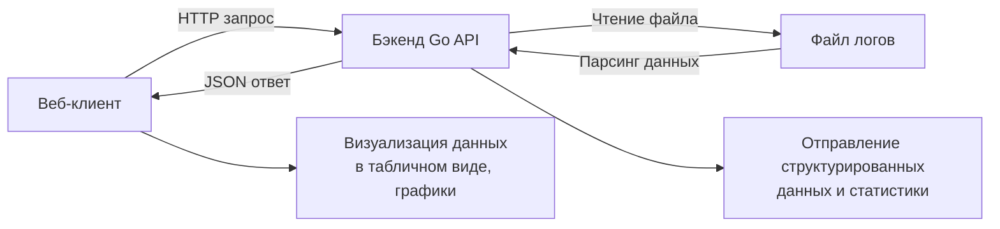
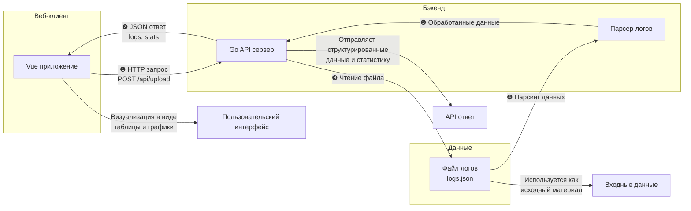
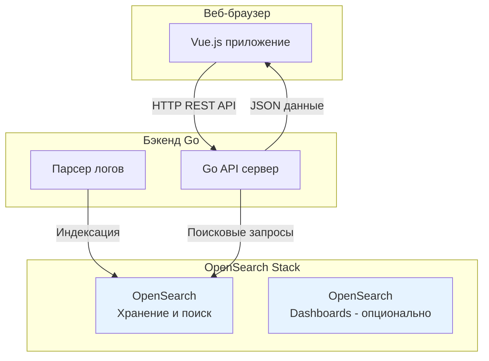

# Взаимодейтсвие компонентов системы

```mermaid
flowchart LR
    A[Веб-клиент] -->|HTTP запрос| B[Бэкенд Go API]
    B -->|JSON ответ| A
    B -->|Чтение файла| C[Файл логов]
    C -->|Парсинг данных| B
    
    A --> D[Визуализация данных<br/>в табличном виде, графики]
    B --> E[Отправление структурированных<br/>данных и статистики]
```

# Эталонное представление

```mermaid
flowchart LR
    subgraph Frontend [Веб-клиент]
        A[Vue приложение]
    end
    
    subgraph Backend [Бэкенд]
        B[Go API сервер]
        C[Парсер логов]
    end
    
    subgraph Data [Данные]
        D[Файл логов<br/>logs.json]
    end
    
    A -- "❶ HTTP запрос<br/>POST /api/upload" --> B
    B -- "❷ JSON ответ<br/>logs, stats" --> A
    B -- "❸ Чтение файла" --> D
    D -- "❹ Парсинг данных" --> C
    C -- "❺ Обработанные данные" --> B
    
    A -- "Визуализация в виде<br/>таблицы и графики" --> E[Пользовательский интерфейс]
    B -- "Отправляет структурированные<br/>данные и статистику" --> F[API ответ]
    D -- "Используется как<br/>исходный материал" --> G[Входные данные]
```
# Возможное представление с использованием OpenSearch

```mermaid
graph TB
    subgraph WebBrowser [Веб-браузер]
        UI[Vue.js приложение]
    end
    
    subgraph BackendServer [Бэкенд Go]
        API[Go API сервер]
        PARSER[Парсер логов]
    end
    
    subgraph OpenSearchStack [OpenSearch Stack]
        OS[OpenSearch<br/>Хранение и поиск]
        DASH[OpenSearch<br/>Dashboards - опционально]
    end
    
    UI -- "HTTP REST API" --> API
    API -- "JSON данные" --> UI
    PARSER -- "Индексация" --> OS
    API -- "Поисковые запросы" --> OS
    
    style OS fill:#e6f3ff
    style DASH fill:#e6f3ff
```

# Задачи 01.10.2025

