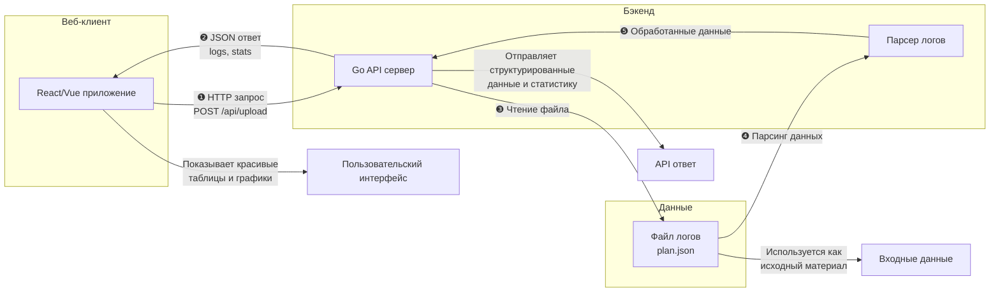
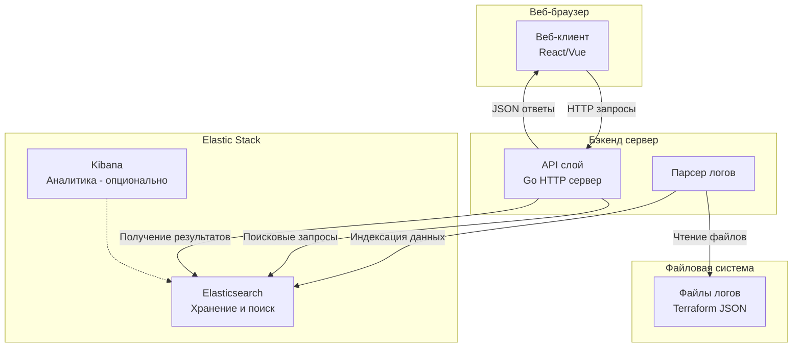

# Взаимодейтсвие компонентов системы
```
┌─────────────────┐    HTTP запрос    ┌──────────────────┐    Чтение файла    ┌─────────────────┐
│                 │ ────────────────► │                  │ ─────────────────► │                 │
│   Веб-клиент    │                   │     Бэкенд       │                    │    Файл логов   │
│                 │ ◄──────────────── │     (Go API)     │ ◄───────────────── │   (plan.json)   │
│                 │    JSON ответ     │                  │   Парсинг данных   │                 │
└─────────────────┘                   └──────────────────┘                    └─────────────────┘
         │                                      │                                      │
         │                                      │                                      │
         │ Показывает красивые                  │ Отправляет структурированные         │ Используется как
         │ таблицы и графики                    │ данные и статистику                  │ исходный материал
         ▼                                      ▼                                      ▼
```


# Эталонное представление

# Схема с использование Elasticsearch


