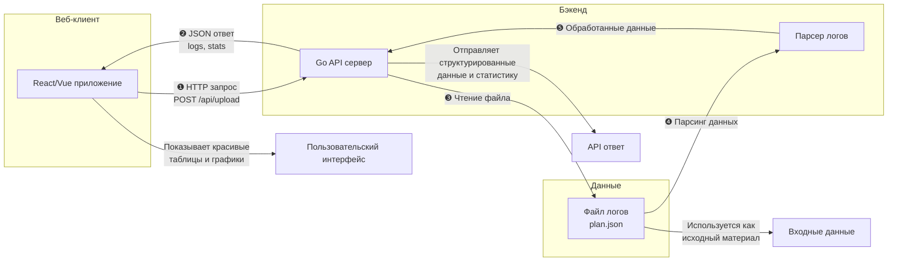

# Эталонное представление

```mermaid
flowchart LR
    subgraph Frontend [Веб-клиент]
        A[React/Vue приложение]
    end
    
    subgraph Backend [Бэкенд]
        B[Go API сервер]
        C[Парсер логов]
    end
    
    subgraph Data [Данные]
        D[Файл логов<br/>plan.json]
    end
    
    A -- "❶ HTTP запрос<br/>POST /api/upload" --> B
    B -- "❷ JSON ответ<br/>logs, stats" --> A
    B -- "❸ Чтение файла" --> D
    D -- "❹ Парсинг данных" --> C
    C -- "❺ Обработанные данные" --> B
    
    A -- "Показывает красивые<br/>таблицы и графики" --> E[Пользовательский интерфейс]
    B -- "Отправляет структурированные<br/>данные и статистику" --> F[API ответ]
    D -- "Используется как<br/>исходный материал" --> G[Входные данные]
```
