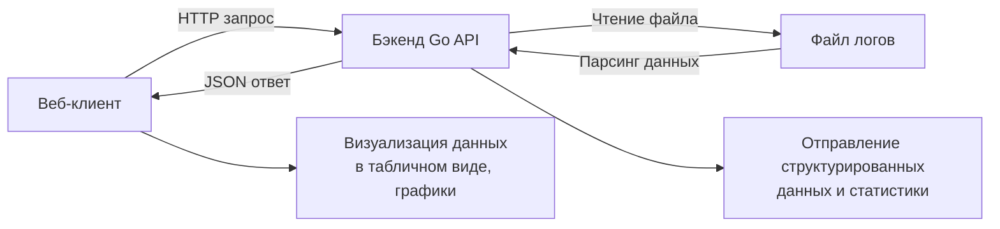

# Блок-схема компонентов системы



# Компонентная архитектура

## 1. Backend Service (Go)
Назначение: Обработка и хранение логов Terraform

Основные модули:

- HTTP Handlers - обработка API запросов

    - `GET /api/logs` - получение логов с фильтрацией

    - `GET /api/status` - получение статистики

    - `POST /api/clear` - очистка данных

- Log Parser - парсинг JSON логов Terraform

    - Извлечение временных меток, уровней логирования
    
    - Классификация записей (HTTP, gRPC, Provider)
    
    - Валидация структуры данных

- Filter Engine - серверная фильтрация

    - По уровню логирования (error, warn, info, debug, trace)
    
    - По временному диапазону
    
    - Ограничение количества записей

**Технические характеристики:**

- Порт: 8080

- Формат данных: JSON

- Поддержка CORS для фронтенда

## 2. Frontend Application (Vue.js)
**Назначение:** Пользовательский интерфейс для анализа логов

**Основные компоненты:**

- **Log Table** - табличное представление логов

    - Сортировка по всем полям
    
    - Клиентская фильтрация
    
    - Пагинация данных

- **Filter Panel** - панель фильтров

    - Выбор уровня логирования
    
    - Поиск по тексту
    
    - Выбор модуля

- **Statistics Dashboard** - визуализация статистики

    - Графики распределения по уровням
    
    - Временные диаграммы
    
    - Статистические карточки

**Технические характеристики:**

- Порт: 3000

- Фреймворк: Vue.js 3

- Библиотеки: Chart.js для графиков

## 3. Взаимодействие компонентов
Протоколы и форматы:

- **HTTP/REST** - основной протокол взаимодействия

- **JSON** - формат обмена данными

- **CORS** - механизм междоменных запросов

**Поток данных:**

1. Пользователь загружает логи через веб-интерфейс

2. Frontend отправляет POST запрос на /api/logs

3. Backend парсит и сохраняет логи в памяти

4. Frontend запрашивает данные через GET /api/logs

5. Backend применяет фильтры и возвращает данные

6. Frontend отображает данные в таблице и графиках

**API endpoints:**

```text
GET  /api/logs    - получение логов (с параметрами фильтрации)
GET  /api/status  - получение статистики
POST /api/clear   - очистка всех логов
```
**Параметры фильтрации:**

- `level` - фильтр по уровню логирования

- `since` - временная нижняя граница

- `until` - временная верхняя граница

- `limit` - ограничение количества записей

## 4. Контейнеризация
**Docker конфигурация:**

- Отдельные контейнеры для backend и frontend

- Сетевой мост для межконтейнерного взаимодействия

- Volume монтирование для разработки frontend

**Запуск системы:**

```bash
docker-compose up --build -d
```


